# Simple Bedrock Connector

> Drop-in OpenAI-compatible API gateway for AWS Bedrock. Use Claude, Llama, Mistral, and any Bedrock model from your favorite AI coding tools — Cursor, Copilot, Cline, Continue, Aider, or anything that speaks the OpenAI API.

[](LICENSE)

---

## Why?

Most AI coding tools only support OpenAI-compatible endpoints. AWS Bedrock has the models you want — Claude 4, Llama 3.3, Mistral Large — but no OpenAI-compatible API. This project bridges that gap with a serverless proxy that:

- **Translates** OpenAI `/v1/chat/completions` requests to Bedrock's Converse API
- **Authenticates** via bearer tokens stored in Secrets Manager (no AWS creds on dev machines)
- **Logs** every request to CloudWatch with identity, model, and token usage
- **Costs** almost nothing to run (~$1/month + Bedrock token costs)

---

## Architecture

```mermaid
flowchart LR
    subgraph LOCAL["🖥️ Local Machine"]
        Script["🐍 Python Script\ngenerate_token.py"]
        IAM["🔐 AWS IAM\nSTS auth"]
        Tools["🛠️ AI Coding Tools\nCursor / Cline\nCopilot / Aider"]
    end

    subgraph AWS["☁️ AWS Cloud"]
        SM["🗝️ Secrets Manager\ntoken → identity"]
        APIGW["🌐 API Gateway\n/v1/chat/completions"]
        Lambda["⚡ Lambda\nvalidate + route"]
        CW["📊 CloudWatch\nrequest logs\nusage metrics"]
        Bedrock["🧠 AWS Bedrock\nClaude / Llama\nMistral / etc"]
    end

    Script -- "① IAM auth" --> IAM
    Script -- "② store token" --> SM
    Tools -- "③ bearer token\n+ payload" --> APIGW
    APIGW -- "④ trigger" --> Lambda
    Lambda -- "⑤ validate" --> SM
    Lambda -- "⑥ log" --> CW
    Lambda -- "⑦ invoke" --> Bedrock
    Bedrock -- "⑧ response" --> Lambda
    Lambda -. "OpenAI format" .-> Tools
```



### Flow

| Step | What Happens |
|------|-------------|
| **①** | Python script authenticates via AWS IAM (STS assume-role) |
| **②** | Script generates a bearer token and stores `token → identity` mapping in Secrets Manager |
| **③** | AI coding tool sends `POST /v1/chat/completions` with bearer token to API Gateway |
| **④** | API Gateway triggers Lambda |
| **⑤** | Lambda validates the bearer token against Secrets Manager |
| **⑥** | Request metadata logged to CloudWatch (identity, model, tokens) |
| **⑦** | Payload forwarded to AWS Bedrock via Converse API |
| **⑧** | Response translated to OpenAI-compatible format and returned |

---

## Quick Start

### Prerequisites

- **AWS CLI** configured with IAM credentials (`aws configure`)
- **Python 3.11+**
- **SAM CLI** ([install guide](https://docs.aws.amazon.com/serverless-application-model/latest/developerguide/install-sam-cli.html))
- **Bedrock model access** enabled in your AWS account ([enable models](https://docs.aws.amazon.com/bedrock/latest/userguide/model-access.html))

### 1. Deploy Infrastructure

```bash
cd infra
sam build
sam deploy --guided
```

SAM will prompt for:
- **Stack name**: `simple-bedrock-connector`
- **Region**: `us-east-1` (or wherever you have Bedrock access)
- **Confirm changeset**: Yes

Save the **API endpoint URL** from the output — you'll need it.

### 2. Generate a Token

```bash
cd scripts
pip install -r requirements.txt

python generate_token.py \
  --identity "jane.doe@dev" \
  --ttl 30d \
  --region us-east-1
```

Output:
```
✓ Authenticated as: arn:aws:iam::123456789:user/jane.doe
✓ Token generated for identity: jane.doe@dev
✓ Stored in Secrets Manager: sbc/tokens/a8Kx9mPq2bNr
✓ Expires: 2026-03-26T04:57:00+00:00

━━━━━━━━━━━━━━━━━━━━━━━━━━━━━━━━━━━━━━━━━━━━━━━━━━━━━━━━━━━━
  Bearer Token: a8Kx9mPq2bNr...
━━━━━━━━━━━━━━━━━━━━━━━━━━━━━━━━━━━━━━━━━━━━━━━━━━━━━━━━━━━━
```

### 3. Configure Your Coding Tool

#### Cursor
```
Settings → Models → OpenAI API Key
  API Key: <your-bearer-token>
  Base URL: https://<api-id>.execute-api.us-east-1.amazonaws.com/v1
```

#### Continue (VS Code)
```json
// .continue/config.json
{
  "models": [{
    "title": "Claude via Bedrock",
    "provider": "openai",
    "model": "claude-4-sonnet",
    "apiBase": "https://<api-id>.execute-api.us-east-1.amazonaws.com/v1",
    "apiKey": "<your-bearer-token>"
  }]
}
```

#### Aider
```bash
export OPENAI_API_KEY=<your-bearer-token>
export OPENAI_API_BASE=https://<api-id>.execute-api.us-east-1.amazonaws.com/v1
aider --model claude-4-sonnet
```

#### Cline (VS Code)
```
Settings → API Provider → OpenAI Compatible
  Base URL: https://<api-id>.execute-api.us-east-1.amazonaws.com/v1
  API Key: <your-bearer-token>
  Model: claude-4-sonnet
```

#### cURL (testing)
```bash
curl -X POST https://<api-id>.execute-api.us-east-1.amazonaws.com/v1/chat/completions \
  -H "Authorization: Bearer <your-token>" \
  -H "Content-Type: application/json" \
  -d '{
    "model": "claude-4-sonnet",
    "messages": [{"role": "user", "content": "Hello!"}],
    "max_tokens": 256
  }'
```

---

## Model Mapping

Use any of these model names in your requests. Unknown model names are passed directly to Bedrock as model IDs.

| Request Model | Bedrock Model | Notes |
|---------------|---------------|-------|
| `claude-4-opus` | `anthropic.claude-4-opus-*` | Most capable |
| `claude-4-sonnet` | `anthropic.claude-4-sonnet-*` | Best balance |
| `claude-3.5-sonnet` | `anthropic.claude-3-5-sonnet-*` | Previous gen |
| `claude-3.5-haiku` | `anthropic.claude-3-5-haiku-*` | Fast + cheap |
| `llama-3.3-70b` | `meta.llama3-3-70b-instruct-*` | Open source |
| `llama-3.1-405b` | `meta.llama3-1-405b-instruct-*` | Largest Llama |
| `mistral-large` | `mistral.mistral-large-*` | Mistral flagship |
| `gpt-4` / `gpt-4o` | → Claude 4 Sonnet | Drop-in compat |
| `gpt-3.5-turbo` | → Claude 3.5 Haiku | Drop-in compat |

### Using Bedrock Model IDs Directly

You can also pass a full Bedrock model ID:

```json
{"model": "anthropic.claude-3-5-sonnet-20241022-v2:0"}
```

---

## Token Management

### Generate Tokens for Multiple Users

```bash
# Developer token (30 days)
python generate_token.py --identity "jane.doe@dev" --ttl 30d

# CI pipeline (7 days)
python generate_token.py --identity "ci-pipeline" --ttl 7d

# Team member (90 days)
python generate_token.py --identity "john.smith@team" --ttl 90d
```

### Token Lifecycle

- Tokens are stored in AWS Secrets Manager with a TTL
- Expired tokens are automatically rejected by the Lambda
- To revoke a token early, delete its secret from Secrets Manager
- Each token is prefixed with `sbc/tokens/` for easy management

### Listing Active Tokens

```bash
aws secretsmanager list-secrets \
  --filter Key=tag-key,Values=app Key=tag-value,Values=simple-bedrock-connector \
  --query 'SecretList[*].[Name,Tags[?Key==`identity`].Value|[0],Tags[?Key==`expires_at`].Value|[0]]' \
  --output table
```

### Revoking a Token

```bash
aws secretsmanager delete-secret \
  --secret-id "sbc/tokens/<token-prefix>" \
  --force-delete-without-recovery
```

---

## CloudWatch Logging

Every request is logged with structured JSON:

### Request Log
```json
{
  "event": "request",
  "identity": "jane.doe@dev",
  "model_requested": "gpt-4o",
  "model_resolved": "anthropic.claude-4-sonnet-20250514-v1:0",
  "message_count": 5,
  "timestamp": "2026-02-24T09:15:30Z"
}
```

### Response Log
```json
{
  "event": "response",
  "identity": "jane.doe@dev",
  "model": "gpt-4o",
  "usage": {
    "prompt_tokens": 1234,
    "completion_tokens": 567,
    "total_tokens": 1801
  },
  "finish_reason": "stop"
}
```

### Useful CloudWatch Insights Queries

```sql
-- Top users by token consumption (last 24h)
filter event = "response"
| stats sum(usage.total_tokens) as total_tokens by identity
| sort total_tokens desc

-- Requests per model
filter event = "request"
| stats count(*) as requests by model_resolved
| sort requests desc

-- Auth failures
filter @message like /Invalid or expired token/
| stats count(*) as failures by bin(1h)

-- Average latency
filter event = "response"
| stats avg(@duration) as avg_ms, p95(@duration) as p95_ms by model
```

---

## Cost Breakdown

| Component | Cost | Notes |
|-----------|------|-------|
| **Lambda** | ~$0.20 / 1M invocations | 256MB, avg 2s per request |
| **API Gateway** | ~$1.00 / 1M requests | REST API pricing |
| **Secrets Manager** | $0.40 / secret / month | One secret per token |
| **CloudWatch Logs** | $0.50 / GB ingested | ~1KB per request |
| **Bedrock** | Per-model pricing | [See Bedrock pricing](https://aws.amazon.com/bedrock/pricing/) |

**Typical monthly cost** for a solo developer (~1,000 requests/day):
- Infrastructure: **< $2/month**
- Bedrock tokens: Varies by model and usage

---

## Security

### Design Principles

- **No AWS credentials on dev machines** — tokens are opaque bearer strings, not IAM keys
- **Least-privilege IAM** — Lambda can only read `sbc/tokens/*` secrets and invoke Bedrock
- **Token expiry** — all tokens have a TTL; expired tokens are rejected automatically
- **Audit trail** — every request logged with identity to CloudWatch
- **No secrets in code** — the repo contains zero credentials, keys, or tokens

### IAM Requirements

**Token generator** (local machine) needs:
- `secretsmanager:CreateSecret` on `arn:aws:secretsmanager:*:*:secret:sbc/tokens/*`
- `sts:GetCallerIdentity` (for auth verification)

**Lambda function** needs (auto-provisioned by SAM):
- `secretsmanager:GetSecretValue` on `sbc/tokens/*`
- `bedrock:InvokeModel`, `bedrock:Converse` on `*`
- `logs:*` for CloudWatch

### Hardening Checklist

- [ ] Enable API Gateway throttling (e.g., 100 req/sec per IP)
- [ ] Add WAF rules if exposing publicly
- [ ] Enable Secrets Manager automatic rotation
- [ ] Set up CloudWatch alarms for auth failures
- [ ] Restrict Bedrock model access to only the models you need
- [ ] Consider VPC endpoints for Bedrock/Secrets Manager if in a VPC

---

## Project Structure

```
simple-bedrock-connector/
├── README.md                          # This file
├── LICENSE                            # MIT
├── .gitignore
├── scripts/
│   ├── generate_token.py              # IAM-authenticated token generator
│   └── requirements.txt               # boto3
├── lambda/
│   └── handler.py                     # API Gateway → Bedrock proxy
├── infra/
│   └── template.yaml                  # SAM/CloudFormation template
└── docs/
    └── architecture.html              # Interactive architecture diagram
```

---

## Configuration

### Environment Variables (Lambda)

| Variable | Default | Description |
|----------|---------|-------------|
| `SECRET_PREFIX` | `sbc/tokens/` | Secrets Manager prefix for tokens |
| `DEFAULT_MODEL` | Claude 4 Sonnet | Fallback when model name not mapped |

### Adding New Models

Edit `MODEL_MAP` in `lambda/handler.py`:

```python
MODEL_MAP = {
    "my-custom-name": "bedrock.model-id-here",
    ...
}
```

Redeploy with `sam build && sam deploy`.

---

## Troubleshooting

| Problem | Cause | Fix |
|---------|-------|-----|
| `401 Unauthorized` | Missing `Authorization: Bearer` header | Add bearer token to request |
| `403 Forbidden` | Token invalid or expired | Generate a new token |
| `502 Bad Gateway` | Bedrock model not enabled | Enable the model in AWS Bedrock console |
| `Timeout` | Model response too slow | Increase Lambda timeout in template.yaml |
| `AccessDeniedException` | Lambda missing Bedrock permissions | Check IAM policy in template.yaml |
| Model not found | Bedrock model ID doesn't exist in region | Check [model availability by region](https://docs.aws.amazon.com/bedrock/latest/userguide/models-regions.html) |

---

## Roadmap

- [ ] Streaming support (`stream: true` → Server-Sent Events)
- [ ] `/v1/models` endpoint (list available models)
- [ ] Token usage quotas per identity
- [ ] Rate limiting per identity
- [ ] Multi-region failover
- [ ] Terraform alternative to SAM

---

## License

[MIT](LICENSE) — Logan Hart, 2026
